# Flutter_Task2 – Smart Shop 🛍️

A Flutter-based shopping app prototype showcasing product listings, search/filter capabilities, and a clean, user-friendly interface.

---

## ✨ Features

### 🌙 Enhanced Dark Theme
- Pure black backgrounds with white text
- Deep grey cards and navbar for improved contrast
- White buttons with black text (in dark mode)
- Theme preference saved using SharedPreferences

### 🎨 Modern UI/UX
- Clean navbar with centered title & icons
- Elegant product cards with spacing and hierarchy
- Responsive layout with Material 3 design
- Smooth animations and transitions

### 🔐 Authentication
- Login & Register screens with form validation
- Persistent login state
- Splash screen with auto-redirect
- Secure logout

### 🏠 Home Page
- Grid of products from FakeStore API
- Pull-to-refresh to fetch new data
- Category filtering with horizontal scroll
- Product ratings with stars
- Dark/light theme support

### 🛒 Shopping Cart
- Add/remove items with quantity control
- Real-time total price calculation
- Cart badge with count
- Persistent cart state
- Checkout functionality

### ❤️ Favorites
- Mark products with heart icon
- View favorites in separate screen
- Saved using SharedPreferences

### 🔍 Sort & Filter
- Sort by price or rating
- Filter by categories
- Bottom sheet UI for sorting options

### 📱 Navigation
- Custom Drawer Menu
- Profile, Cart, Favorites, Logout
- Theme toggle
- User statistics

---

## 🧑‍💻 Tech Stack

| Component         | Technology            |
|------------------|-----------------------|
| Framework        | Flutter (Dart)        |
| State Management | Provider              |
| Persistence      | SharedPreferences     |
| API              | [FakeStore API](https://fakestoreapi.com) |
| Networking       | http package          |
| Image Handling   | cached_network_image  |
| Rating Bar       | flutter_rating_bar    |

---

## 🗂 Project Structure

    lib/
    ├── main.dart                      # App entry point
    ├── models/                        # Data models
    │   ├── product.dart               # Product model
    │   └── cart_item.dart             # Cart item model
    ├── providers/                     # State management
    │   ├── auth_provider.dart         # Handles login & registration state
    │   ├── cart_provider.dart         # Manages cart operations
    │   ├── favorites_provider.dart    # Manages favorite items
    │   ├── product_provider.dart      # Fetches product data from API
    │   └── theme_provider.dart        # Theme toggling and persistence
    ├── screens/                       # App screens/pages
    │   ├── splash_screen.dart         # Splash/loading screen
    │   ├── login_screen.dart          # User login and registration
    │   ├── home_screen.dart           # Main product listing page
    │   ├── cart_screen.dart           # Shopping cart page
    │   ├── favorites_screen.dart      # User’s favorite items
    │   └── profile_screen.dart        # Profile and app settings
    └── widgets/                       # Reusable UI components
    ├── product_card.dart          # Displays product info in a card layout
    └── sort_filter_bottom_sheet.dart  # UI for sorting/filtering options


---

## 🚀 Getting Started

### 📋 Prerequisites

To build and run this project, ensure you have the following installed:

- **Flutter SDK** (v3.0.0 or higher)
- **Dart SDK** (bundled with Flutter)
- **Android Studio** or **Visual Studio Code**

### 🛠 Installation

1. **Clone the repository**
   ```bash
   https://github.com/Nafizanowrin/Flutter_Task2
   cd smart-shop

2. Install dependencies
   ```bash
   flutter pub get

4. Run the app
   ```bash
    flutter run

## 🔐 Demo Credentials
   You can log in using the following test credentials:

   Email: nowrin@gmail.com

   Password: nowrin


## 🔧 Key Features Implementation
🧩 State Management with Provider
   The app uses the Provider package for clean and efficient state management across multiple modules:

   - User Authentication

   - Shopping Cart Functionality

   - Favorites List

   - Product Data Handling

   - Theme Switching

## 💾 SharedPreferences Integration
The app ensures persistence through SharedPreferences, storing:

   - Login state

   - Theme preference (dark/light)

   - Favorite items

   - User email for display in Profile

## 🌐 RESTful API Integration
   Product data is fetched from the FakeStore API with robust handling:

   - Dynamic data loading on app start

   - Pull-to-refresh to reload product list

   - Error handling for failed requests

   - Category filtering and sorting support

## 🎨 Modern UI/UX Design
   Built with Material Design 3, the UI offers:

   - Clean, intuitive layouts

   - Responsive product grids

   - Animated transitions

   - A polished dark mode with high contrast

   - Consistent theming across screens

## 🌟 Extra Features
✅ Category Filtering – Browse products by category (e.g., electronics, fashion)

✅ Pull-to-Refresh – Refresh product listings with a swipe gesture

✅ Advanced Sorting – Sort products by price or rating

✅ Beautiful UI – Sleek, minimal design with proper spacing and color contrast

✅ Error Handling – Comprehensive feedback for network and API errors

✅ Loading Indicators – Smooth transitions and visual feedback during data loads

✅ Responsive Design – Scales seamlessly across different screen sizes

✅ Enhanced Dark Mode – Full black UI with readable white text and deep grey accents

✅ Modern Navbar – Includes menu actions, theme toggle, and a clean profile drawer

✅ Smart Product Cards – Designed with depth and contrast for readability and style


## 📸 Screenshots

### 1. Splash Screen  
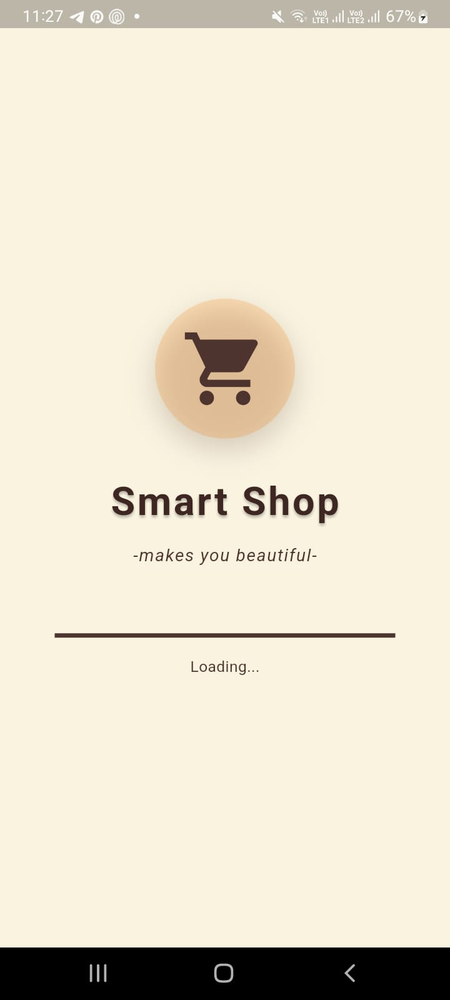

### 2. Register Page  
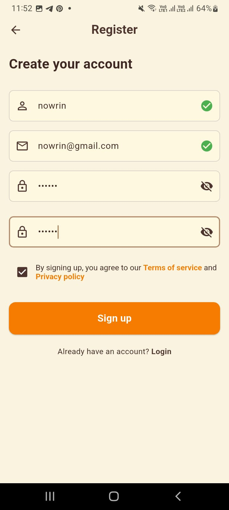

### 3. Login Page  
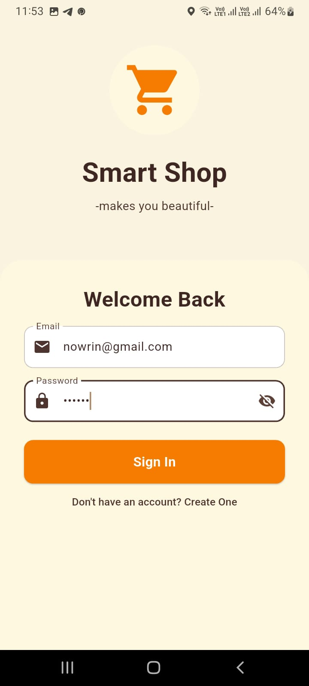

### 4. Home Screen  
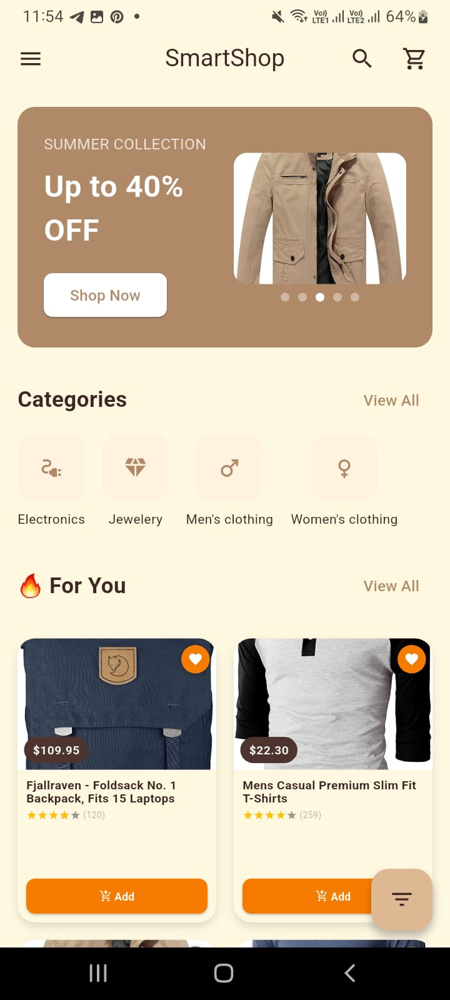
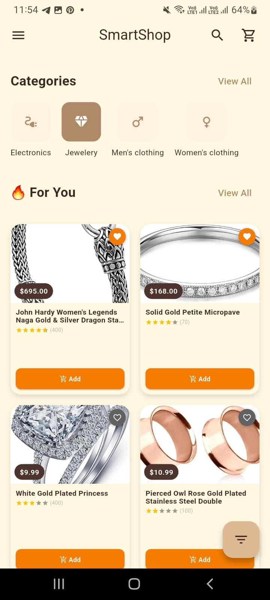
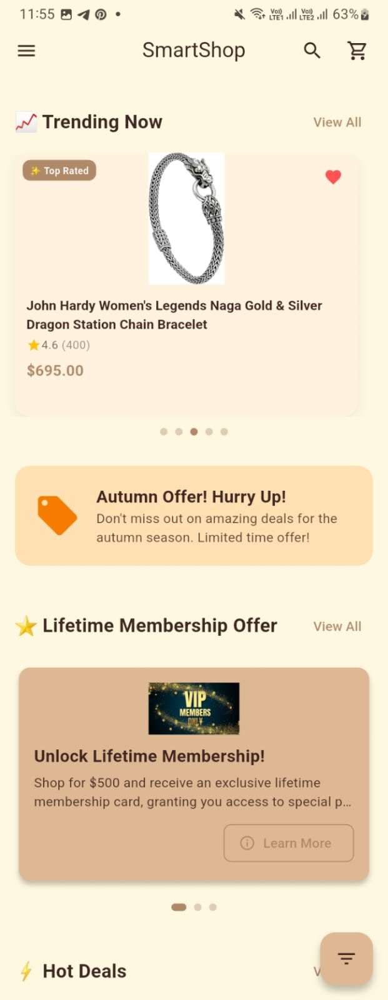
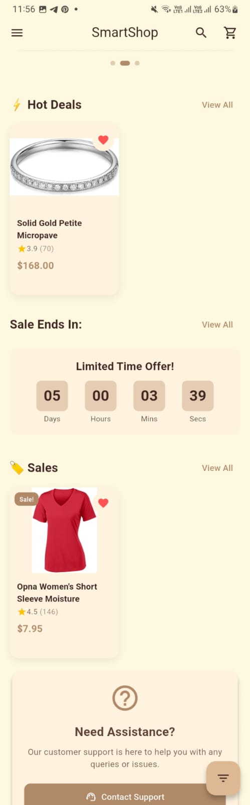
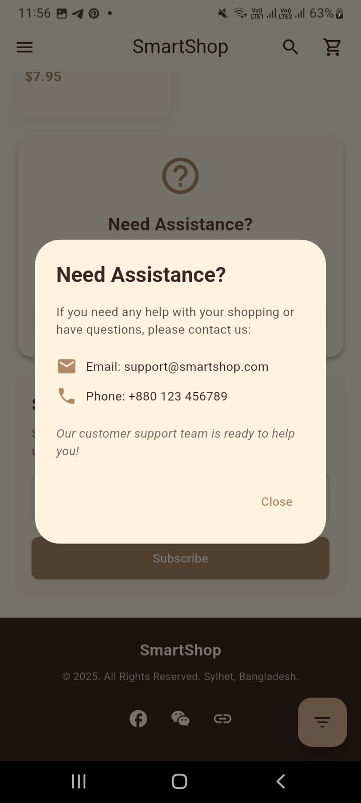
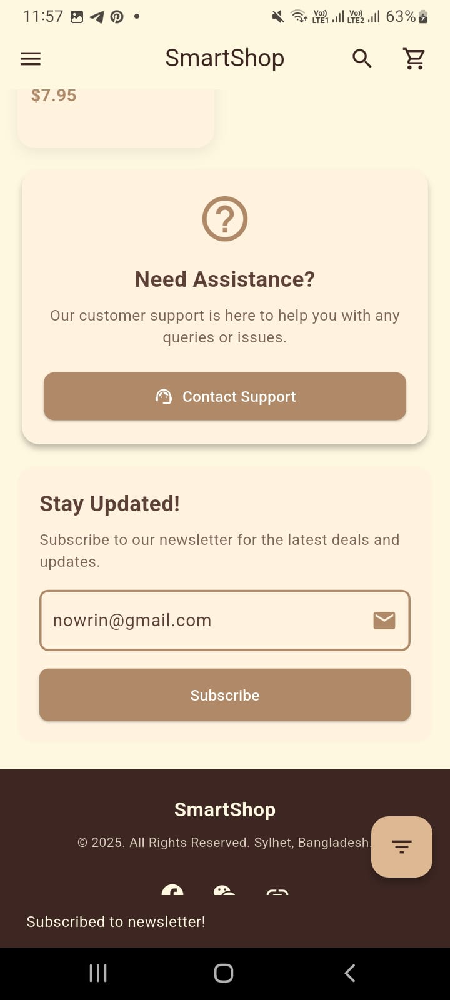

### 5. Sort & Filter Option  


### 6. Shopping Cart  
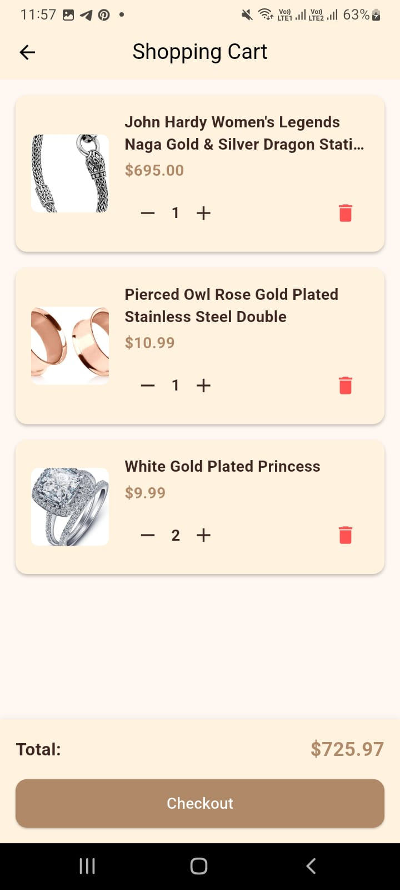

### 7. Search Bar  
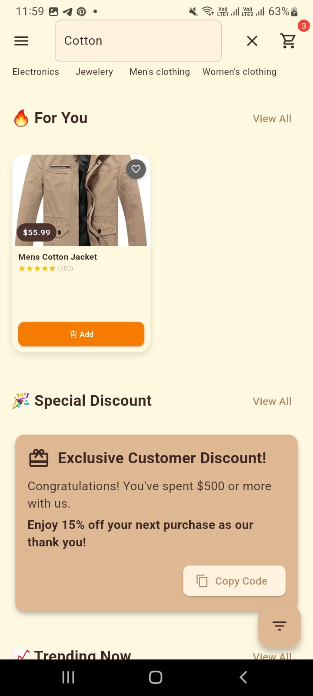

### 8. Drawer  
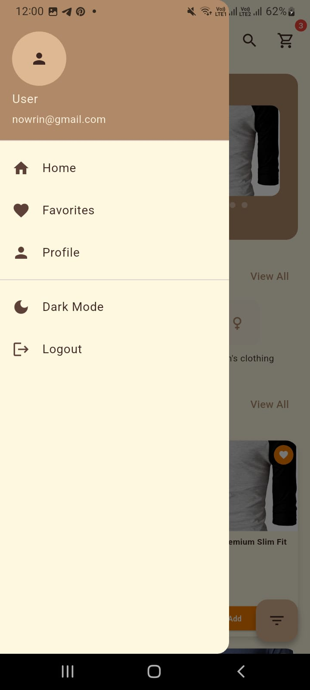

### 9. Favorites  


### 10. Profile  
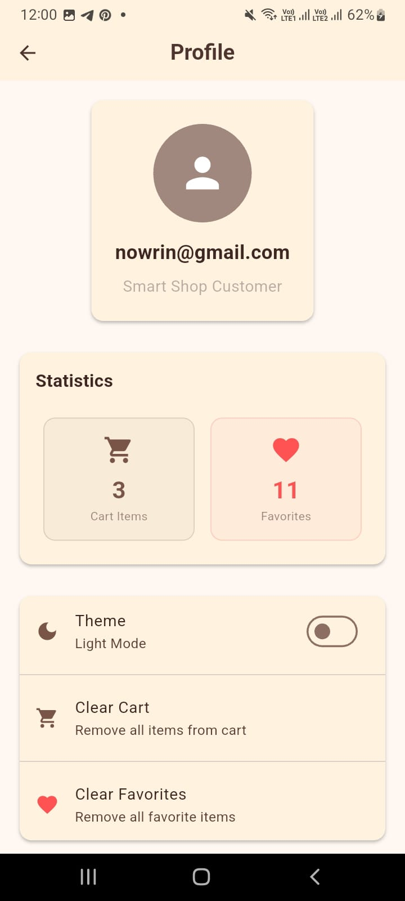

### 11. Dark Mode  


---
## 🤝 Contributing
1. Fork the repository
2. Create a feature branch
3. Commit your changes
4. Push to the branch
5.Create a Pull Request

## 📄 License
This project is licensed under the MIT License.

## 🙏 Acknowledgments
1. FakeStore API for providing product data
2. Flutter team for the amazing framework
3. Provider package for state management
4. Material Design for UI guidelines


